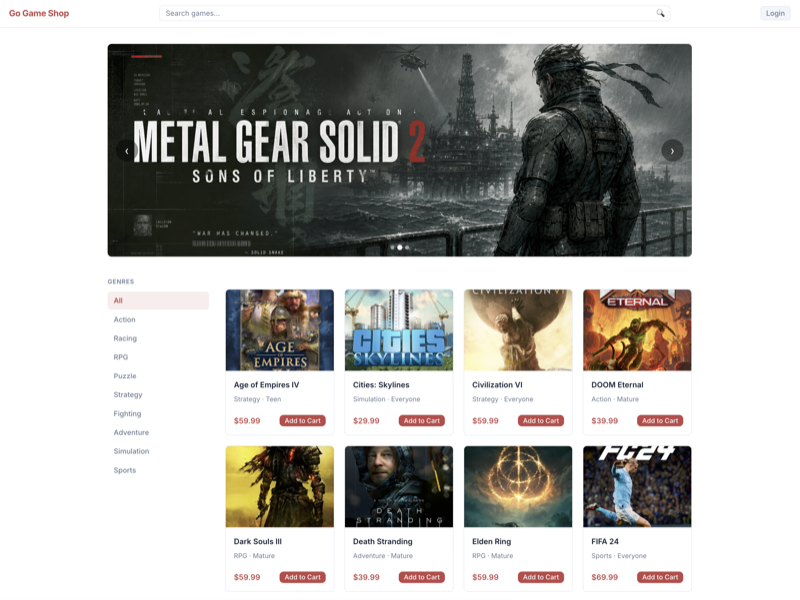
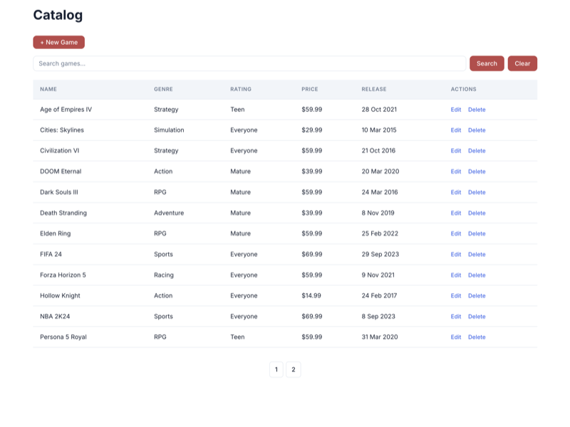
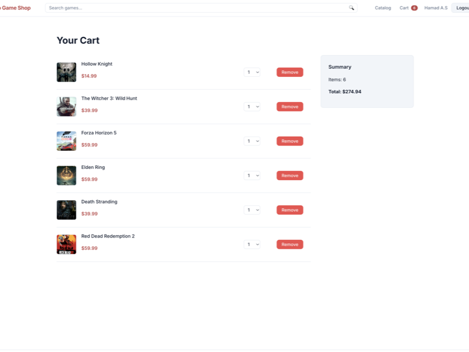
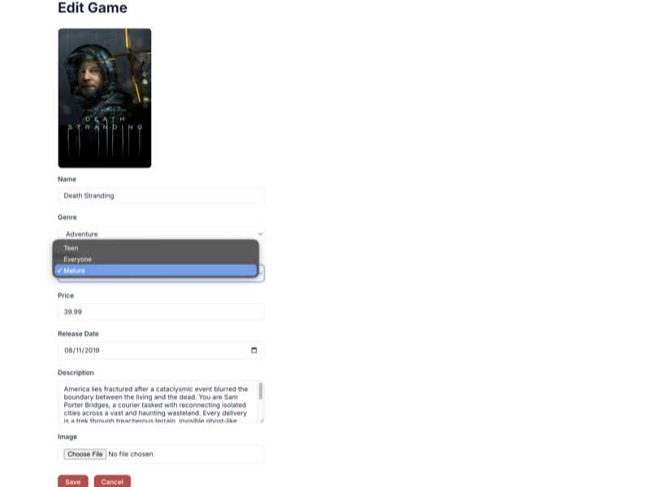

# GoGameShop (In Progress)

A production-ready game store API for selling digital game keys. Built with the modern .NET stack, focusing on clean
architecture and minimal API patterns.

---

**Build transparency**

| Area | Approach | What that means |
|---|---|---|
| Backend | Hand-typed C# | Limiting AI use for learning. I use it when concepts are retained |
| Docs, notes & tests | Collaborated | AI draft/scaffold, reviewed by me |
| Frontend | Prompted | This is not the focus of this project. Complete understanding isn't relevant for now |

📓 **Dev Notes** — Running notes I take while building this project. [View notes →](./NOTES.md)

---

## Overview

GoGameShop is a full-stack game store for selling digital game keys. The backend is an ASP.NET Core Minimal API that
manages a catalog of games with browsing, search, genre filtering, and CRUD operations. The frontend is a Blazor Static
SSR app that serves the storefront — listings, game detail, basket, and Keycloak-authenticated checkout.

## Screenshots

<table width="100%">
  <tr>
    <td align="center" width="50%">
      <a href="screenshots/home.png"></a><br />
      <em>Storefront: carousel, genre sidebar, paginated game grid</em>
    </td>
    <td align="center" width="50%">
      <a href="screenshots/catalog.png"></a><br />
      <em>Admin catalog: searchable table with Edit and Delete actions</em>
    </td>
  </tr>
  <tr><td colspan="2" height="16"></td></tr>
  <tr>
    <td align="center" width="50%">
      <a href="screenshots/cart.png"></a><br />
      <em>Cart: drop-down for quantity controls, remove game, and order summary</em>
    </td>
    <td align="center" width="50%">
      <a href="screenshots/edit-game.png"></a><br />
      <em>Edit game form: image preview, API-populated dropdowns, file upload</em>
    </td>
  </tr>
</table>

## Technology Stack

- **Language:** C# 14
- **Framework:** ASP.NET Core 10.0 (Minimal APIs)
- **Database:** SQLite (PostgreSQL migration planned)
- **ORM:** Entity Framework Core 10.0
- **Frontend:** Blazor (Static SSR)
- **Payments:** Stripe Integration (Planned)
- **Package Manager:** NuGet (via `dotnet` CLI)

## Requirements

- [.NET 10.0 SDK](https://dotnet.microsoft.com/download/dotnet/10.0)
- [dotnet-ef](https://learn.microsoft.com/en-us/ef/core/cli/dotnet) Global Tool (for managing migrations)
- [Docker Desktop](https://www.docker.com/products/docker-desktop/) (for running Keycloak locally)

## Setup & Run

1. **Clone the repository:**
   ```bash
   git clone <repository-url>
   cd GoGameShop
   ```

2. **Restore dependencies:**
   ```bash
   dotnet restore
   ```

3. **Apply Database Migrations:**
   The application uses SQLite. To set up the initial database:
   ```bash
   dotnet ef database update --project Backend/src/GoGameShop.Api
   ```
   *Note: The application calls `InitializeDbAsync()` on startup, which automatically applies migrations and seeds
   initial data (9 genres, 3 ratings, and 20 games). To reseed, delete `GoGameShop.db` and restart the API.*

4. **Start Keycloak (local IAM server, development only):**
   ```bash
   cd Backend/localinfra
   docker compose up -d
   ```
   The Keycloak admin console is available at `http://localhost:8080` (bootstrap credentials: `admin` / `admin`). The
   committed `gogameshop-realm.json` can be imported via *Realm settings → Action → Partial import* to restore the realm,
   roles, and clients (including `gogameshop-api`, `gogameshop-frontend`, and `postman`).

   Keycloak is only registered as a JWT bearer scheme when `ASPNETCORE_ENVIRONMENT=Development`. The deployed API
   (`Production`) accepts only Microsoft Entra tokens; see the `Authentication:Schemes:Entra` section below.

5. **Run the API:**
   ```bash
   dotnet run --project Backend/src/GoGameShop.Api
   ```
   The API will be available at `http://localhost:5002`.

6. **Run the frontend:**
   ```bash
   dotnet run --project Frontend/src/GoGameShop.Frontend
   ```
   The frontend will be available at `http://localhost:5003`.

## Scripts & Commands

- **Build:** `dotnet build`
- **Run API:** `dotnet run --project Backend/src/GoGameShop.Api`
- **Run frontend:** `dotnet run --project Frontend/src/GoGameShop.Frontend`
- **Run tests:** `dotnet test Backend/GoGameShop.Api.sln`
- **Add Migration:** `dotnet ef migrations add <MigrationName> --project Backend/src/GoGameShop.Api`
- **Update Database:** `dotnet ef database update --project Backend/src/GoGameShop.Api`

## Environment Variables & Configuration

Configuration is managed via `appsettings.json` and `appsettings.Development.json`.

- **ConnectionStrings:GoGameShop:** SQLite connection string — defined in `appsettings.Development.json` (Default:
  `Data Source=GoGameShop.db`).
- **Logging:** Log levels are configured per namespace. EF Core SQL command logging is set to `Warning` in development
  to suppress verbose query output.
- **Authentication:Schemes:Keycloak:** JWT bearer options for the named `Keycloak` scheme (registered only in
  `Development`). `Authority` is the Keycloak realm URL and `ValidAudience` is the expected `aud` claim (the Keycloak
  client ID). .NET 8+ binds these onto `JwtBearerOptions` automatically, no `builder.Configuration.Bind(...)` glue
  needed.
- **Authentication:Schemes:Entra:** JWT bearer options for the named `Entra` scheme (registered in all environments).
  `Authority` is the External ID tenant issuer URL (`https://<tenant-id>.ciamlogin.com/<tenant-id>/v2.0`) and
  `ValidAudience` is the API application's client ID GUID (matches the token's `aud` claim). Same auto-binding rules
  apply.
- **Multi-scheme selection:** the default scheme is `KeycloakOrEntra`, a policy scheme that inspects each incoming
  token's `iss` claim and forwards to either the Keycloak or Entra handler. Tokens whose issuer host contains
  `ciamlogin.com` go to Entra; everything else goes to Keycloak.

### Frontend (`Frontend/src/GoGameShop.Frontend/appsettings.json`)

- **ApiBaseUrl:** Base URL of the backend API (`http://localhost:5002`).
- **Keycloak:MetadataAddress:** OIDC discovery document URL for the `gogameshop` realm.
- **Keycloak:ClientId:** The frontend's Keycloak client ID (`gogameshop-frontend`).
- **Keycloak:ClientSecret:** The frontend's client secret (confidential client).

## API Endpoints

### Games

| Method   | Route         | Description                                                                                                         |
|----------|---------------|---------------------------------------------------------------------------------------------------------------------|
| `GET`    | `/games`      | Get a paginated, filterable list of games (supports `pageNumber`, `pageSize`, `Name`, and `Genre` query params)     |
| `GET`    | `/games/{id}` | Get a single game by ID                                                                                             |
| `POST`   | `/games`      | Create a new game (accepts `multipart/form-data`; optional `ImageFile` field) — requires `AdminAccess` policy       |
| `PUT`    | `/games/{id}` | Update an existing game (accepts `multipart/form-data`; optional `ImageFile` field) — requires `AdminAccess` policy |
| `DELETE` | `/games/{id}` | Delete a game by ID — requires `AdminAccess` policy                                                                 |

### Baskets

| Method | Route               | Description                                                                                                                               |
|--------|---------------------|-------------------------------------------------------------------------------------------------------------------------------------------|
| `GET`  | `/baskets/{userId}` | Get a customer's basket with items and total amount. Returns an empty basket if none exists — requires `UserAccess` policy (via fallback) |
| `PUT`  | `/baskets/{userId}` | Create or replace a customer's basket (upsert) — requires `UserAccess` policy (via fallback)                                              |

### Frontend Endpoints

These routes are registered in `Frontend/src/GoGameShop.Frontend/Program.cs`. The browser POSTs to the frontend server,
which then calls the backend API via `BasketState`. They all require authentication.

| Method | Route | Description |
|--------|-------|-------------|
| `POST` | `/basket/add` | Add a game to the basket; redirects back to `returnUrl` |
| `POST` | `/basket/remove` | Remove a game from the basket; redirects to `/cart` |
| `POST` | `/basket/update` | Update item quantity; redirects to `/cart` |

### Genres & Ratings

| Method | Route      | Description     |
|--------|------------|-----------------|
| `GET`  | `/genres`  | Get all genres  |
| `GET`  | `/ratings` | Get all ratings |

## Project Structure

```text
GoGameShop/
├── Backend/
│   ├── .vscode/   # VS Code publish task and App Service deploy settings
│   ├── src/       # ASP.NET Core Minimal API
│   └── tests/     # xUnit unit and integration tests
├── Frontend/      # Blazor Static SSR frontend
├── postman/       # Postman workspace (collections, environments, globals)
└── .postman/      # Postman backup/config
```

Full annotated structure: [notes/project-setup.md](notes/project-setup.md#project-structure)

## Tests

Two test projects live under `Backend/tests/`:

- **`GoGameShop.Api.UnitTests`** — xUnit + NSubstitute. 10 tests covering pure logic in `BasketAuthorizationHandler` (5)
  and `KeycloakClaimsTransformer` (5).
- **`GoGameShop.Api.IntegrationTests`** — xUnit + `Microsoft.AspNetCore.Mvc.Testing` + `Microsoft.EntityFrameworkCore.Sqlite`.
  5 tests covering the games and baskets endpoints. The host runs in-process via `WebApplicationFactory<Program>`
  against a SQLite in-memory database, and a custom `TestAuthHandler` builds a `ClaimsPrincipal` from request headers
  so tests can authenticate without running Keycloak.

Run the whole suite:

```bash
dotnet test Backend/GoGameShop.Api.sln
```

Full breakdown of each test and what it proves: [notes/testing.md](notes/testing.md#tests-in-this-project).

### Manual testing

- **HTTP file:** Use `Backend/gogameshop.http` with
  the [REST Client](https://marketplace.visualstudio.com/items?itemName=humao.rest-client) extension in VS Code or the
  built-in HTTP client in JetBrains Rider.
- **Postman:** Import collections from `postman/collections/` and environments from `postman/environments/` into Postman. Two environments are provided: `Local` (`http://localhost:5002`) and `Azure` (the deployed App Service URL).

## License

This project is licensed under the MIT License - see the [LICENSE](LICENSE) file for details.

## Roadmap

```
▓▓▓▓▓▓▓▓▓▓  Vertical Slice Architecture, REST API, CRUD, DTOs, EF Core, SQLite
▓▓▓▓▓▓▓▓▓▓  Middleware, HTTP Logging, Error Handling, Pagination, Search, File System, OpenAPI
▓▓▓▓▓▓▓▓▓▓  JWT Authentication, Role & Policy Authorization, Keycloak, OAuth 2.0, OpenID Connect
▓▓▓▓▓▓▓▓▓▓  Blazor Frontend — Game Catalogue, Listings, Game Detail, Search, Basket, Keycloak Auth
▓▓▓▓▓▓▓▓▓▓  Unit & Integration Testing — xUnit, NSubstitute, WebApplicationFactory, SQLite in-memory
░░░░░░░░░░  Azure App Service, PostgreSQL, Blob Storage, Key Vault, CDN, CI/CD Pipelines
░░░░░░░░░░  Containerization, .NET Aspire, Health Checks, Azure Container Apps
░░░░░░░░░░  Background Workers, Service Bus, Outbox Pattern, Stripe Payments
```
